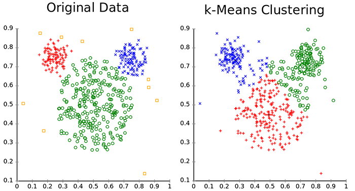

# Customer Segmentation - Clustering sample

## Problem

The objective of the problem is find clusters of related customers, which can support future marketing campaigns. This is a classic unsupervised problem, as the training data has no information to directly group customers. 

The training dataset is located in the `assets/inputs` folder, and split between two files. The offers file contains information about past marketing campaigns:

|Offer #|Campaign|Varietal|Minimum Qty (kg)|Discount (%)|Origin|Past Peak|
|-------|--------|--------|----------------|------------|------|---------|
|1|January|Malbec|72|56|France|FALSE|
|2|January|Pinot Noir|72|17|France|FALSE|
|3|February|Espumante|144|32|Oregon|TRUE|
|4|February|Champagne|72|48|France|TRUE|
|5|February|Cabernet Sauvignon|144|44|New Zealand|TRUE|

The transactions file contains information about customer purchases (related to marketing campaigns):

|Customer Last Name|Offer #|
|------------------|-------|
|Smith|2|
|Smith|24|
|Johnson|17|
|Johnson|24|
|Johnson|26|
|Williams|18|


## ML Task - Clustering

The ML Task is Clustering, however, this example trains multiple models each one based on a different learner/algorithm and finally evaluates the accuracy of each approach, so you can choose the trained model with better accuracy.
The algorithm used for this task is K-Means. In short, this algorithm assign samples from the dataset to **k** clusters:
* K-Means does not figure out the optimal number of clusters, so this is an algorithm parameter
* K-Means minimizes the distance between each point and the centroid (midpoint) of the cluster
* all points belonging to the cluster have similar properties (but these properties does not necessarily directly map to the features used for training, and are often objective of further data analysis)

The following picture shows a clustered data distribution, and then, how k-Means is able to re-build data clusters.



From the former figure, one question arises: how can we plot a sample formed by different features in a 2 dimensional space? This is a problem called "dimensionality reduction": each sample belongs to a dimensional space formed by each of his features (offer, campaign, etc), so we need a function that "translates" observation from the former space to another space (usually, with much less features, in our case, only two: X and Y). In this case, we will use a common technique called PCA, but there exists similar techniques, like SVD which can be used for the same purpose.

## Solution
In the root folder, there are two folders: 
* assets contains all the assets required (assets/inputs) or produced (assets/output) by the solution
* src contains the source code of the training and predicting processes

The  main solution `CustomerSegmentation.sln` is inside the src folder, and contains two projects. Once you open the solution in Visual Studio, first step is to create the customer segmentation model. For this, set the project `CustomerSegmentation.Train` as Startup project in Visual Studio, and hit F5. A console application will appear and it will create the model (and saved in the assets/output folder).

The second step is to get the actual customer clusters. For this, set the project `CustomerSegmentation.Predict` as Startup project, and hit F5. After executing the predict console app, a plot will be generated in the assets/output folder, showing the cluster distribution (similar to the following figure):


## Code Walkthrough

### Data Pre-Processing
The first thing is to join the data into a single view. Because we need to compare transactions made the users, we will build a pivot table, where the rows are the customers and the columns are the campaigns, and the cell value shows if the customer made some transaction in during that campaign.
The pivot table is built executing PreProcess function:
```csharp
// inner join datasets
var clusterData = (from of in offers
                   join tr in transactions on of.OfferId equals tr.OfferId
                   select new
                   {
                       of.OfferId,
                       of.Campaign,
                       of.Discount,
                       tr.LastName,
                       of.LastPeak,
                       of.Minimum,
                       of.Origin,
                       of.Varietal,
                       Count = 1,
                   }).ToArray();

// pivot table (naive way)
var pivotDataArray =
    (from c in clusterData
     group c by c.LastName into gcs
     let lookup = gcs.ToLookup(y => y.OfferId, y => y.Count)
     select new PivotData()
     {
         C1 = (float)lookup["1"].Sum(),
         C2 = (float)lookup["2"].Sum(),
         C3 = (float)lookup["3"].Sum(),
         // ...
      };
```

The data is saved into the file `pivot.csv`, and it looks like the following table:

|C1|C2|C3|C4|C5|C6|C8|C9|C10|C11|C12|C13|C14|C15|C16|C17|C18|C19|C20|C21|C22|C23|C24|C25|C26|C27|C28|C29|C30|C31|C32|LastName|
|--|--|--|--|--|--|--|--|---|---|---|---|---|---|---|---|---|---|---|---|---|---|---|---|---|---|---|---|---|---|---|--------|
|1|0|0|1|0|0|0|0|1|0|1|0|0|1|0|0|0|0|0|0|0|0|0|0|0|1|0|0|0|0|0|0|Thomas|
|1|1|0|0|0|0|0|0|0|0|1|0|0|0|1|0|0|0|0|0|0|1|0|0|0|0|0|0|0|0|0|0|Jackson|
|1|1|0|0|0|0|0|0|0|0|0|0|0|0|0|0|0|0|0|0|0|0|0|0|0|0|0|0|0|0|0|0|Mitchell|


### ML.NET: Model creation
Next, the learning pipeline is built in the method BuildModel.
```csharp
// Reading file
var reader = TextLoader.CreateReader(env,
                c => (
                    Features: c.LoadFloat(0, 31),
                    LastName: c.LoadText(32)),
                separator: ',', hasHeader: true);

var clustering = new ClusteringContext(env);

var est = reader.MakeNewEstimator()
    .Append(row => (row.LastName, LastNameKey: row.LastName.ToKey(), row.Features, PCAFeatures: row.Features.ToPrincipalComponents(rank: 2, (p) => p.Seed = 42)))
    .Append(row => (
        row.LastName, 
        row.LastNameKey, 
        row.PCAFeatures, 
        row.Features,
        preds: clustering.Trainers.KMeans(row.Features, clustersCount: kClusters)
    ));
```
In this case, `TextLoader` is not defining explicitly each column, but declares a Features property made by the first 30 columns of the file; also declares the property LastName to the value of the last column.

Then, you need to apply some transformations to the data:
1) add a PCA column, using the `.ToPrincipalComponents()` extension method, passing as parameter `rank: 2`, which means that we are reducing the features from 32 to 2 dimensions (*x* and *y*)
2) add a preds column, which holds the results of the KMeans algorithm, using the `clustering.Trainers.KMeans()`; main parameter to use with this learner is `clustersCount`, that specifies the number of clusters

After building the pipeline, we train the customer segmentation model:
```csharp
var dataSource = reader.Read(new MultiFileSource(pivotLocation));
var model = est.Fit(dataSource);
```

Finally, we save the model to local disk using the dynamic API:
```csharp
using (var f = new FileStream(modelLocation, FileMode.Create))
    model.AsDynamic.SaveTo(env, f);
```

Additionally, we evaluate the accuracy of the model. This accuracy is measured using the [ClusterEvaluator](#), and the [Accuracy](https://en.wikipedia.org/wiki/Confusion_matrix) and [AUC](https://loneharoon.wordpress.com/2016/08/17/area-under-the-curve-auc-a-performance-metric/) metrics are displayed.

```csharp
// Evaluate model
var metrics = clustering.Evaluate(data, r => r.preds.score, r => r.LastNameKey, r => r.Features);
```

### ML.Net: Model Prediction

The model created during last step is used in the project `CustomerSegmentation.Predict`. Basically, the `ModelEvaluator.Evaluate()` method executes the following code:
```csharp
var reader = TextLoader.CreateReader(env,
    c => (
        Features: c.LoadFloat(0, 31),
        LastName: c.LoadText(32)),
        separator: ',', hasHeader: true);

var predictions = model
    .Transform(reader.Read(new MultiFileSource(pivotDataLocation)).AsDynamic)
    .AsEnumerable<ClusteringPrediction>(env, false)
    .ToArray();
```

Additionally, the method `SaveCustomerSegmentationPlot()` saves an scatter plot drawing the samples in each assigned cluster, using the [OxyPlot](http://www.oxyplot.org/) library.
